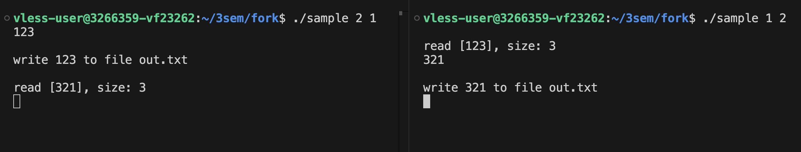

# Задачи по КТ

## Fork

Задачи: 1-5 тестовые и не представляют интереса

[Задача 6](fork/6.cpp): 2 программы в 2-х терминалах "общаются" через 2 файла(одна программа пишет в первый файл и его читает вторая программа, аналогично вторая программа пишет во второй файл и его читает первая)

Использование: нужно запустить скрипт `./6_start.sh` и следовать указаниям

# Литература:

* В.Е. Карпов, К.А. Коньков: Основы операционных систем
